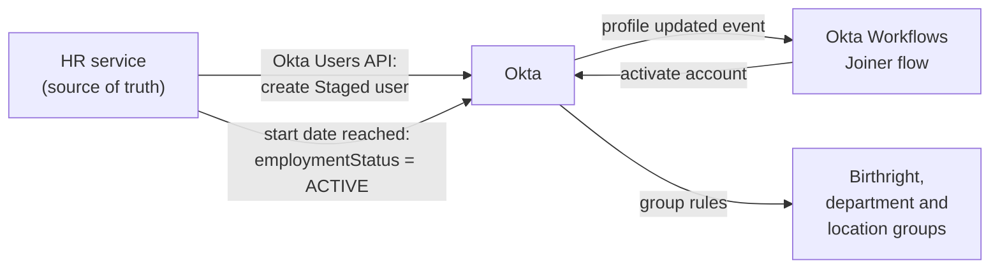
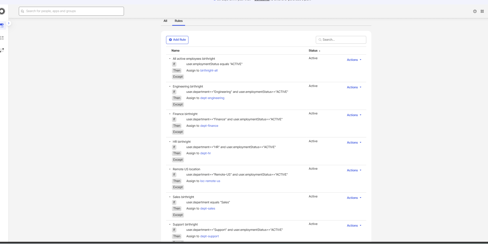
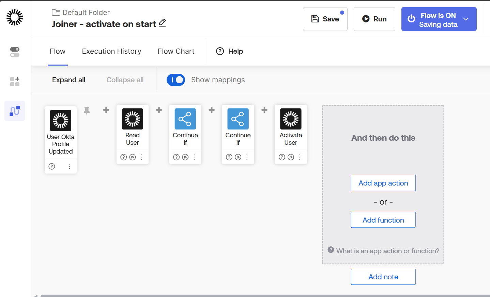
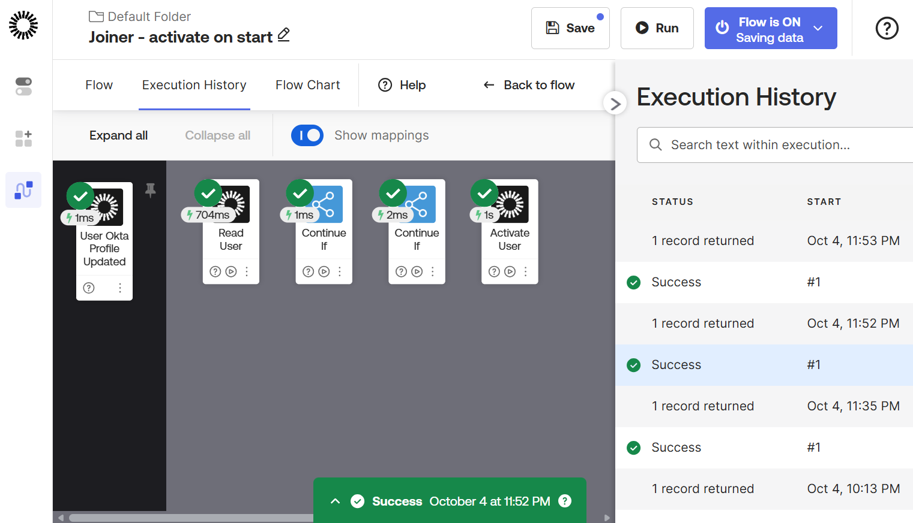
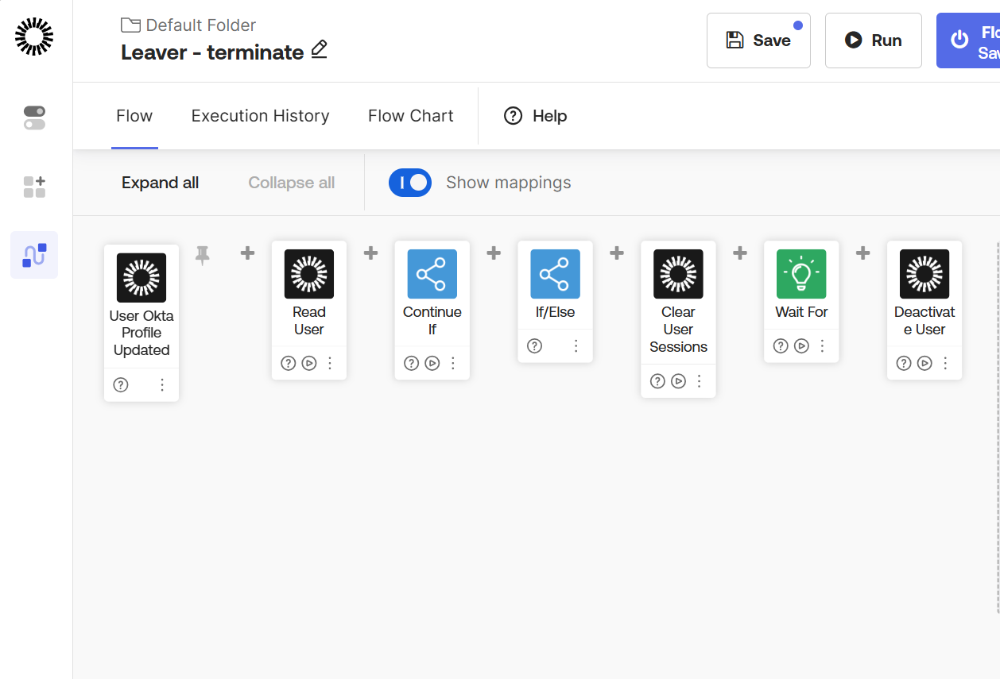
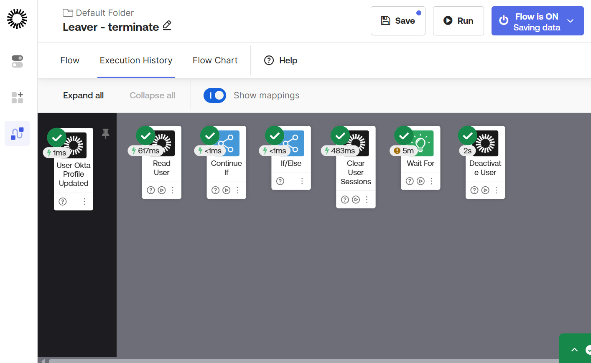

# iam-lab

# IAM Lab: Workforce Identity Lifecycle and M&A Migration

A hands-on lab that runs a company's employee identity lifecycle the way large enterprises do: HR is the source of truth, and access in Okta follows HR changes automatically, with no manual account administration.

The lab simulates a company (Acme) that later acquires another company (Globex) and migrates its identities into Okta.

> Personal learning project. All people, emails and data are fake (`.test` domains). No secrets are stored in this repo.

## What works today

| Area | Status | What it does |
| --- | --- | --- |
| Mock HR system (Java, Spring Boot) | Working | Hire, transfer and terminate workers through a REST API |
| HR to Okta sync | Working | Every HR change is pushed to Okta through the Okta Users API |
| Joiner automation (Okta Workflows) | Working | New hires are created Staged, then activated automatically on their start date |
| Birthright access (Okta group rules) | Working | Department, location and all-employee groups assigned from HR attributes |
| Reconciliation | Working | Script compares HR against Okta and repairs drift |
| Leaver automation | Working | Suspend active users, clear sessions, remove access, deactivate after a hold period |
| Mover access review | Planned | Flag manually granted access when someone changes departments |
| SCIM 2.0 provisioning (Java, Spring Boot) | Working | Okta creates, updates and deactivates users in a custom SCIM app; termination in HR deprovisions automatically |
| OIDC login portal (Java, Spring Security) | Working | Users sign in through Okta with the authorization code flow; app shows the ID token claims |
| OAuth scopes, SAML, LDAP | Planned | Protect an API with OAuth scopes; SAML app; LDAP directory sync |
| Acquisition migration (Auth0 to Okta) | Planned | Day-one federation, identity matching, password import hook, cutover runbook |
| CI/CD on AWS | Planned | GitHub Actions, Terraform for Okta, keyless OIDC federation to AWS |

## How the joiner flow works



1. HR hires a worker. The HR service creates the Okta account in a **Staged** state, so nothing works before day one.
2. A scheduled job in the HR service marks workers **ACTIVE** once their start date arrives and sends the change to Okta.
3. An Okta Workflow listens for profile updates, checks that the person is ACTIVE in HR but still Staged in Okta, and activates the account.
4. Okta group rules grant birthright, department and location access from the profile attributes. When someone changes departments, the rules move their groups automatically.


## Screenshots

**Status-gated birthright group rules**


**Joiner flow (Okta Workflows) and a successful run**



**Leaver flow and a successful run**




## Design notes and lessons learned

- **HR decides when, Okta decides how.** The HR service owns the start date; Okta Workflows owns the activation logic. Each system does the job it is authoritative for.
- **Actor versus target.** Workflows event cards expose both the actor (who made the change) and the user who was changed. Mapping the actor by mistake made the flow read the admin account instead of the new hire. Found and fixed using saved execution data.
- **Platform limits shape the design.** The Okta trial org caps both total users and active users, enforced separately. An activation that looked like a permissions failure (HTTP 403) was actually the active-user cap. The dataset is sized to fit both limits.
- **Backfills are part of go-live.** Automation only reacts to new events, so existing users needed a one-time activation script when the flow went live.
- **Reconciliation catches drift.** A partial failure left HR and Okta out of sync; a reconciliation job compares both and repairs the difference, as production lifecycle systems do.

## Tech stack

Okta Identity Engine, Okta Workflows, Okta group rules, Okta Users API, Java 21, Spring Boot, H2, Python, Git, WSL (Ubuntu). Planned: Auth0, AWS (ECS, Secrets Manager, IAM Identity Center), Terraform, GitHub Actions.

## Repository layout

| Folder | Contents |
| --- | --- |
| `hr-source/` | Mock HR service (Spring Boot): workers, Okta client, start-date job |
| `scripts/` | Seed data generator, HR loader, Okta reconciliation and admin scripts |
| `scim-service/` | SCIM 2.0 provisioning server (bearer token auth) |
| `acme-portal/` | OIDC login portal (Spring Boot, Okta authorization code flow) |
| `migration/` | Planned: acquisition migration tooling |
| `terraform/` | Planned: Okta and AWS as code |
| `docs/` | Design docs, decision records and screenshots |

## Running it locally

Prerequisites: Java 21, Python 3, an Okta org with an API token.

```bash
# 1. Secrets live in a local .env file (never committed)
#    OKTA_ORG_URL=https://<your-org>.okta.com
#    OKTA_API_TOKEN=<token>

# 2. Generate fake employees
cd scripts && python3 -m venv .venv && source .venv/bin/activate
pip install faker requests && python seed.py
cp acme_workers.csv ../hr-source/src/main/resources/

# 3. Start the HR service
cd ../hr-source
set -a; source ../.env; set +a
./mvnw spring-boot:run

# 4. Load workers into HR (and Okta)
cd ../scripts && python load_hr.py --all
```
